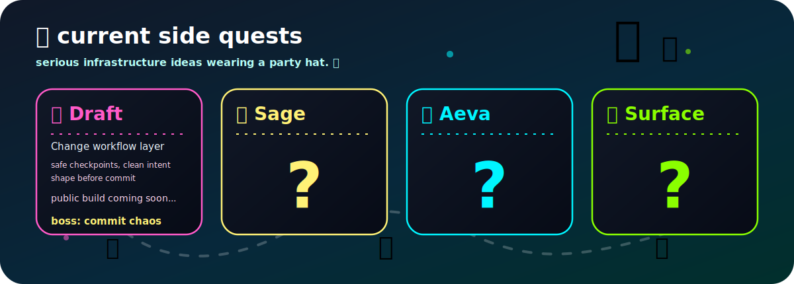
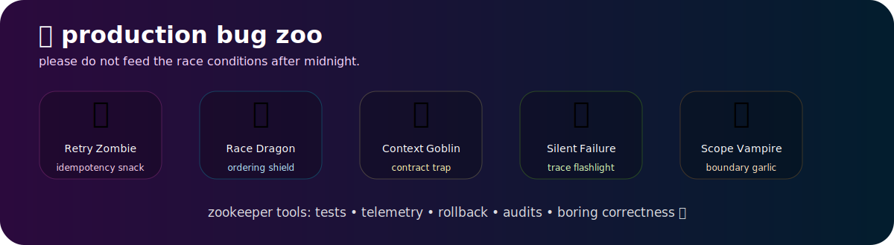
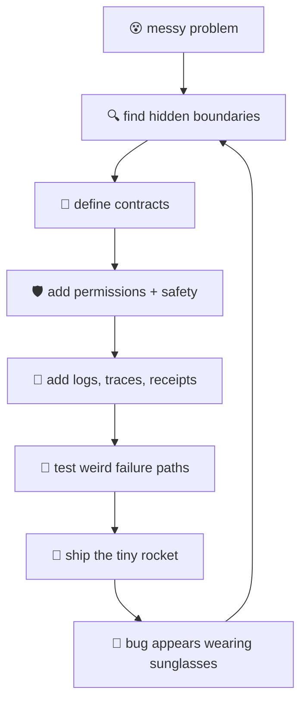

<!--
README.md for https://github.com/Shiva936/Shiva936

Theme:
cheerful chaos systems goblin × futuristic arcade × founder-engineer credibility.

Put these files in ./assets/
├── chaos-hero.svg
├── quest-board.svg
├── silly-telemetry.svg
├── bug-zoo.svg
└── footer-party.svg
-->

<p align="center">
  
</p>

<p align="center">
  
</p>

<p align="center">
  <a href="https://github.com/Shiva936">
    
  </a>
  
  
  
  
</p>

<p align="center">
  
</p>

---

## 👋 Hi there, welcome to the tiny infrastructure carnival

I am **Shiv Deepak Sharma** — a backend / systems engineer who looked at modern AI agents and immediately started asking annoying questions like:

> “Nice demo. But where are the permissions? Where are the receipts? Who approved the robot touching production? Why is this workflow held together by vibes, a shell script, and fear?” 🤖🧃💥

So now I build toward systems that are **useful, observable, recoverable, permissioned, and boring in production** — chaotic only in the README.

My serious side: **Go backend engineering, distributed systems, payments-grade correctness, observability, production services, data flows, reliability, and secure system boundaries.**

My silly side: I treat bugs like tiny dungeon monsters and architecture docs like treasure maps drawn by a caffeinated raccoon. 🦝🗺️✨

---

## 🧃 character selection screen

<table>
  <tr>
    <td width="33%" align="center">
      <h3>🧱 Backend Builder</h3>
      <p>APIs, services, workers, data flows, idempotency, reconciliation, and boring reliability magic.</p>
    </td>
    <td width="33%" align="center">
      <h3>🧠 AI Infra Tinkerer</h3>
      <p>Agents, local-first context, inference runtimes, tool execution, memory, permissions, and audit trails.</p>
    </td>
    <td width="33%" align="center">
      <h3>🧾 Trust Goblin</h3>
      <p>Receipts, rollback, capabilities, sandboxing, least privilege, and proof that the system did the right thing.</p>
    </td>
  </tr>
</table>

```txt
class Shiv:
    default_mode = "systems goblin"
    favorite_problem = "messy system boundary"
    usual_response = "wait, what happens when this fails?"
    special_move = "turn chaos into boxes, contracts, logs, and receipts"
    weakness = "overthinking infrastructure"
    rare_drop = "a README with too many emojis"
```

---

## 🗺️ current side quests

<p align="center">
  
</p>

<p align="center">
  <b>The quest board says enough for now.</b><br/>
  Some doors are still locked. Some goblins are still negotiating with product scope. 🧌🔐
</p>

---

## 📡 github telemetry, but make it an unexplored quest

<p align="center">
  
</p>

<p align="center">
  <b>No generic scoreboard here.</b><br/>
  My real telemetry is whether the system became safer, clearer, and harder to break. 🧯✨
</p>

---

## 🎒 inventory bag

<table>
  <tr>
    <td><b>🗡️ Primary weapon</b></td>
    <td>Go, backend services, distributed systems, APIs, workers, production debugging</td>
  </tr>
  <tr>
    <td><b>🧪 Lab tools</b></td>
    <td>Rust, Python, Linux, local inference, agents, runtime boundaries</td>
  </tr>
  <tr>
    <td><b>🧰 Utility belt</b></td>
    <td>PostgreSQL, Redis, queues, gRPC, observability, traces, logs, metrics</td>
  </tr>
  <tr>
    <td><b>🧾 Trust items</b></td>
    <td>Idempotency, reconciliation, audit trails, rollback, capability design, sandboxing</td>
  </tr>
  <tr>
    <td><b>🍪 Emergency snacks</b></td>
    <td>Architecture diagrams, TODO lists, coffee, stubborn optimism, and one suspicious shell script</td>
  </tr>
</table>

<p align="center">
  
</p>

---

## 🐛 production bug zoo

<p align="center">
  
</p>

<p align="center">
  I like systems where every monster has a name, every risk has a boundary, and every failure has a recovery path. 🧌🧪🧯
</p>

---

## 🧠 my brain when looking at a system



---

## 🥳 things I get weirdly excited about

- 🧾 **Commit receipts** for AI-generated code.
- 🛡️ **Capability-based permissions** instead of “just trust the agent bro.”
- 🧠 **Local-first AI systems** where users own their context and memory.
- 🧰 **Backend correctness**: retries, reconciliation, recovery, idempotency.
- 📡 **Observability** that tells the truth when everything is on fire.
- 🏗️ **Architecture that survives production**, not just whiteboards.
- 🧌 **Tiny infrastructure goblins** that become serious products.
- 🪤 **Failure traps** that catch bugs before users do.
- 🚪 **Hidden boundaries** that explain why a system feels cursed.

---

## 🎮 unlockable collaboration modes

<table>
  <tr>
    <td align="center"><b>🚀 Startup Mode</b></td>
    <td>Give me ambiguity, constraints, and a hard problem. I will turn it into a buildable system.</td>
  </tr>
  <tr>
    <td align="center"><b>🧯 Production Mode</b></td>
    <td>Give me a messy backend, failure-prone workflow, or unclear system boundary. I will chase the gremlins.</td>
  </tr>
  <tr>
    <td align="center"><b>🤖 Agent Mode</b></td>
    <td>Give me AI automation that feels too magical. I will add permissions, audit, rollback, and trust.</td>
  </tr>
  <tr>
    <td align="center"><b>🧠 Research Mode</b></td>
    <td>Give me a strange infrastructure thesis. I will overthink it until it becomes an architecture.</td>
  </tr>
</table>

---

## 🔭 currently doing

```txt
🔭 Working on:        hidden infra quests + Draft
🌱 Learning:          deeper Rust / systems / AI runtime boundaries
💬 Ask me about:      Go, backend systems, observability, AI-agent safety, weird infra ideas
🤝 Collaborate on:    developer tools, platform engineering, runtime systems, secure automation
⚡ Fun fact:          I name bugs like RPG enemies so they become easier to defeat
```

---

## 🪩 tiny manifesto

```txt
I do not want AI systems that feel like haunted autocomplete.
I want systems with boundaries.
I want agents with receipts.
I want developer tools that make code safer, not just faster.
I want local-first infrastructure where users keep control.
I want production systems that fail loudly, recover cleanly, and explain what happened.

Also, I want all of this with more emojis.
```

---

## 📬 summon me for

<p align="center">
  
  
  
  
  
</p>

<p align="center">
  <b>Bring me a hard infrastructure problem, a cursed developer workflow, an AI-agent reliability mess, or a production bug wearing a tiny hat.</b>
</p>

<p align="center">
  <b>I will not just implement it. I will turn it into a system.</b> 🧃🚀✨
</p>

<p align="center">
  
</p>
